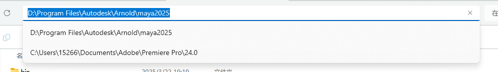

#### Install MtoA plugin

Even if you already have a arnold tab by default in maya 2025, install this plugin from official website: https://manage.autodesk.com/products/MAYA?version=2025&platform=WIN64&language=EINT is required.  
Download this and install:  

After you installed, you can find some path like this:

#### Setting environment variables

-   `ARNOLD_PATH` to `D:\Program Files\Autodesk\Arnold\maya2025` (the path of mtoa you installed)

-   `ARNOLD_PLUGIN_PATH` to `your plugin folder`, in this case is `/plugin` of this project
-   `MTOA_TEMPLATES_PATH` the same as `ARNOLD_PLUGIN_PATH`
-   Add `%ARNOLD_PATH%\bin` to your system's `PATH` variable

#### Setting output path in visual studio

change the "output dir" of the project to `/plugin` of this project, then compile.
Maya will automatically load the .dll shader.
